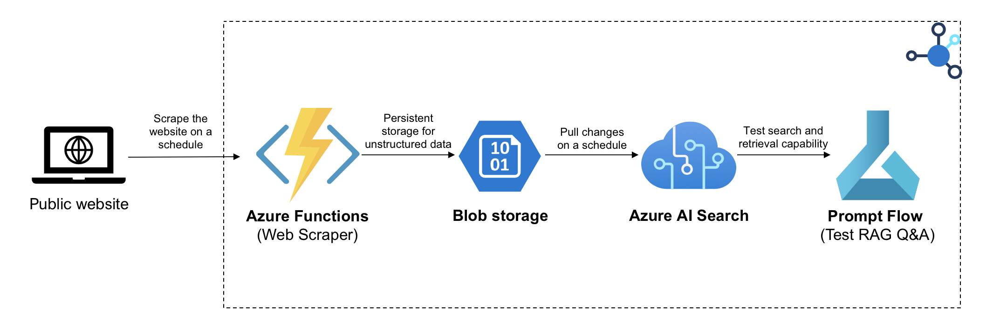

# Chat with Web Content using Azure OpenAI and AI Search

## Overview

This example demonstrates an approach for creating ChatGPT-like experiences using data pulled from public websites using the Retrieval Augmented Generation pattern.

This example showcases how you can extract content from public websites into an Azure AI Search index. It uses an Azure Function to extract content and from a web page and Azure AI Search for data indexing and retrieval.

The below diagram shows a high-level design for the solution:

The solution consists of:

- **Azure Functions**: Scrape the website on a schedule.
- **Blob Storage**: Store the text in a blob storage for easy consumption​.
- **Azure AI Search**: manage ingestion, vectorization and search optimization​.
- **Azure ML Prompt Flow**: est the quality and speed using an endpoint which will simulate RAG Q&A with the search engine​.

## Getting Started

### Environment Variables

To run this project, you need to configure the following environment variables on your Azure Function app:

- `PROJECT_URL`: The URL of the website that you want to extract content from. For example, `https://contoso.com`.
- `PROJECT_NAME`: The name of the project. This will be used as a prefix for Blobs that will be created that will be created. For example, `contoso-realestate`.
- `STORAGE_CONTAINER_NAME`: The name of the Azure Storage container that will store the extracted content. For example, `contoso-content`.
- `STORAGE_CONNECTION`: The connection string for the Azure Storage account that contains the storage container. You can find it in the Azure portal or use the Azure CLI. For example, `DefaultEndpointsProtocol=https;AccountName=contoso;AccountKey=...`.
- `SEARCH_SERVICE_NAME`: The name of the Azure AI Search service that will provide the search and retrieval capabilities. For example, `contoso-search`.
- `SEARCH_API_KEY`: The admin key for the Azure AI Search service. You can find it in the Azure portal or use the Azure CLI. For example, `A1B2C3D4E5F6G7H8I9J0K1L2M3N4O5P6`.
- `SEARCH_INDEX_NAME`: The name of the Azure AI Search index that will store the vector embeddings of the extracted content. For example, `contoso-index`.
- `SEARCH_INDEXER_NAME`: The name of the Azure AI Search indexer that will populate the search index with the extracted content. For example, `contoso-indexer`.
- `SEARCH_DATASOURCE_NAME`: The name of the Azure AI Search data source that will connect the search service with the storage container. For example, `contoso-datasource`.

You can set these environment variables using the Azure portal, the Azure CLI, or the Azure Functions Core Tools. For more details, see [Manage your function app](https://learn.microsoft.com/en-us/azure/azure-functions/functions-how-to-use-azure-function-app-settings?tabs=portal).